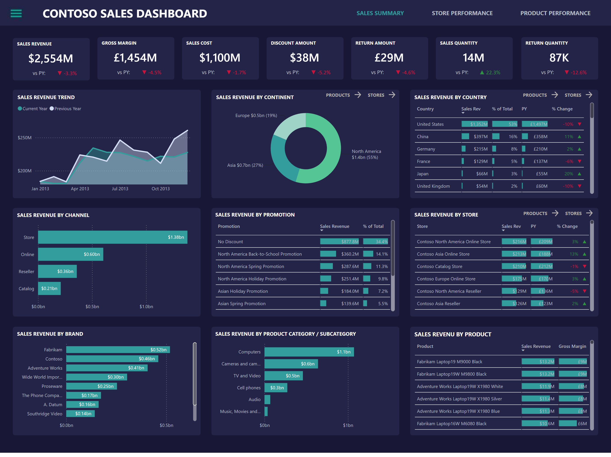
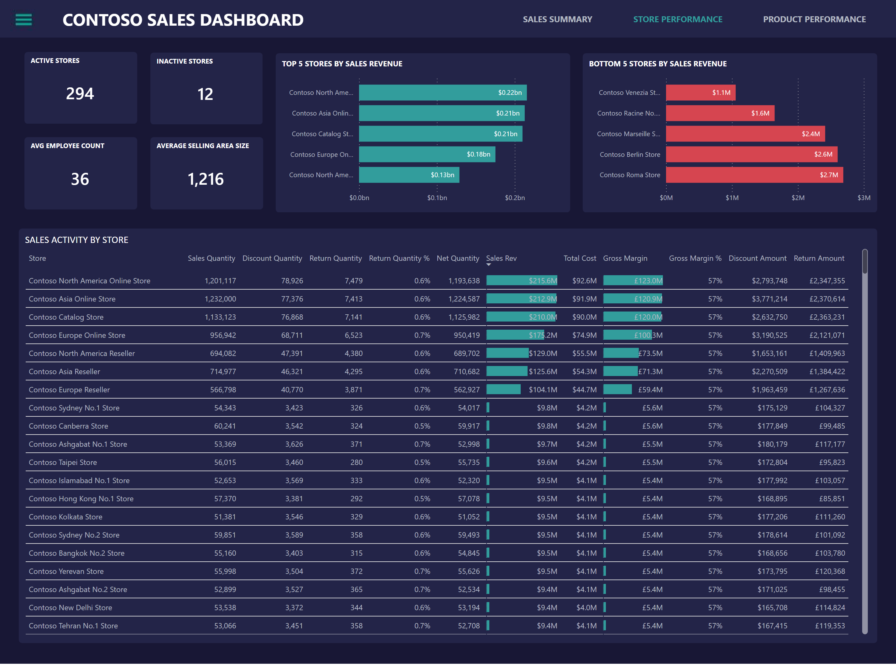
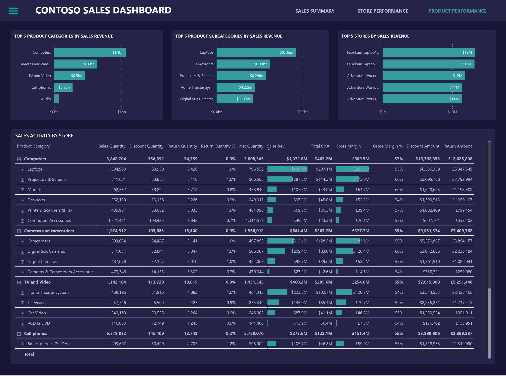
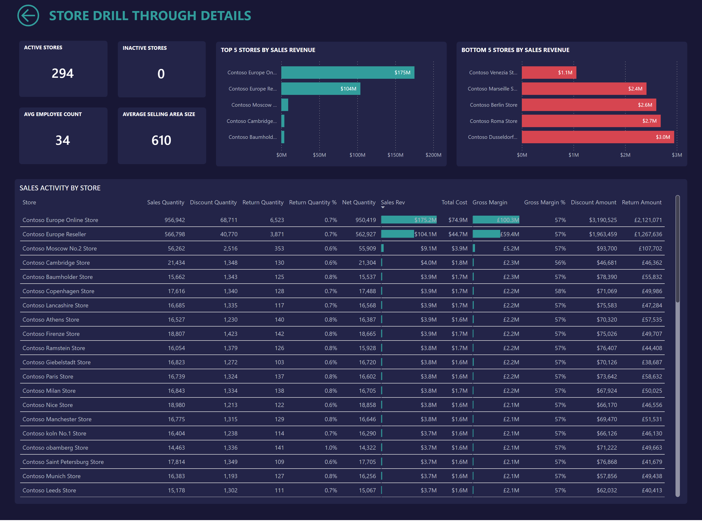
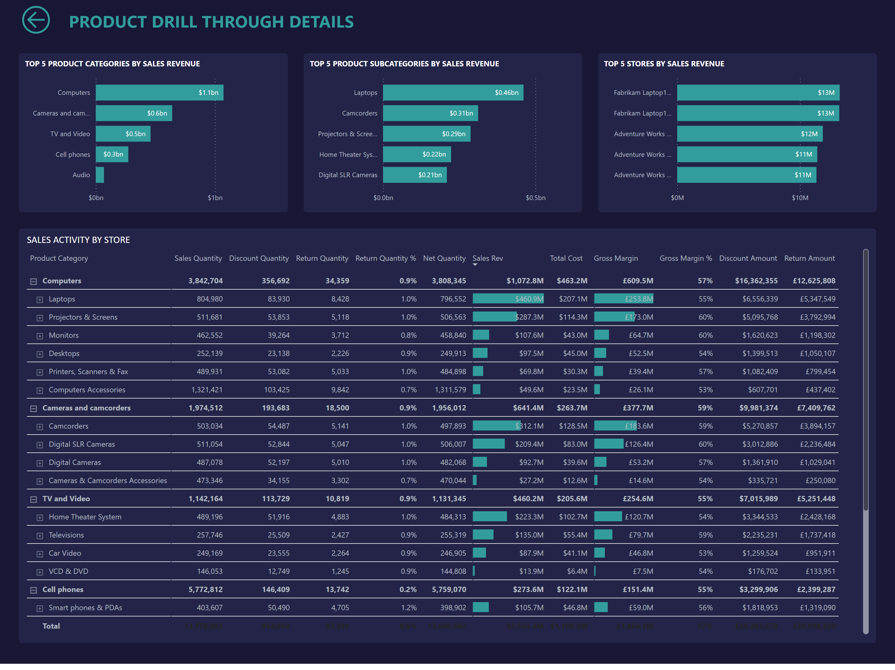

# Contoso Sales Dashboard

## Overview

An interactive sales-performance report designed to move from an executive sales summary into store-level and product-level analysis. Dedicated drill-through pages support investigation of individual stores and products.

The screenshots use the Contoso demonstration dataset and contain no private tenant or customer information.

## Report pages

1. **Sales Summary** — high-level sales performance overview
2. **Store Performance** — comparison and analysis by store
3. **Product Analysis** — product-level performance analysis
4. **Store Drillthrough** — detailed context for a selected store
5. **Product Drillthrough** — detailed context for a selected product

## Business questions

- How is overall sales performance changing?
- Which stores are outperforming or underperforming?
- Which products are driving results?
- What explains the performance of a specific store or product?

## Capabilities demonstrated

- Executive-to-detail report navigation
- Store and product performance analysis
- Context-aware drill-through pages
- Multi-page dashboard design
- Custom visual integration

## Gallery

### Sales summary

### Store performance

### Product analysis

### Store drill-through

### Product drill-through

## Data and privacy

The source PBIX remains private and is excluded from Git. Before publishing screenshots or sample data, confirm that the Contoso dataset is synthetic or licensed for public redistribution.
