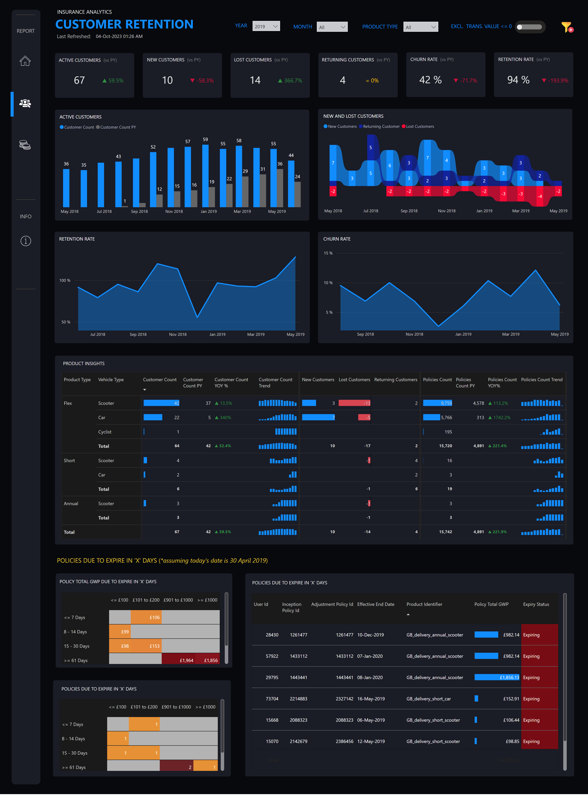

# Insurance Analytics — Customer Retention

## Overview

An insurance analytics report focused on understanding customer retention and presenting the indicators that help identify retention patterns and potential areas for action.

The dashboard demonstrates customer, churn, retention, and expiring-policy analysis using portfolio data prepared for this project.

## Report pages

1. **Customer Retention** — primary retention analysis
2. **Info** — report guidance and supporting information

## Business questions

- What is the current customer-retention position?
- Which customer or policy segments show elevated retention risk?
- Where should retention activity be prioritized?
- Which indicators should be monitored over time?

## Capabilities demonstrated

- Retention-focused KPI design
- Segmentation and comparative analysis
- User guidance through a dedicated information page
- Insurance-domain dashboard storytelling

## Gallery

### Customer retention

## Data and privacy

The source PBIX remains private and is excluded from Git. Do not publish customer identifiers, policy details, personally identifiable information, internal targets, or confidential retention figures.
