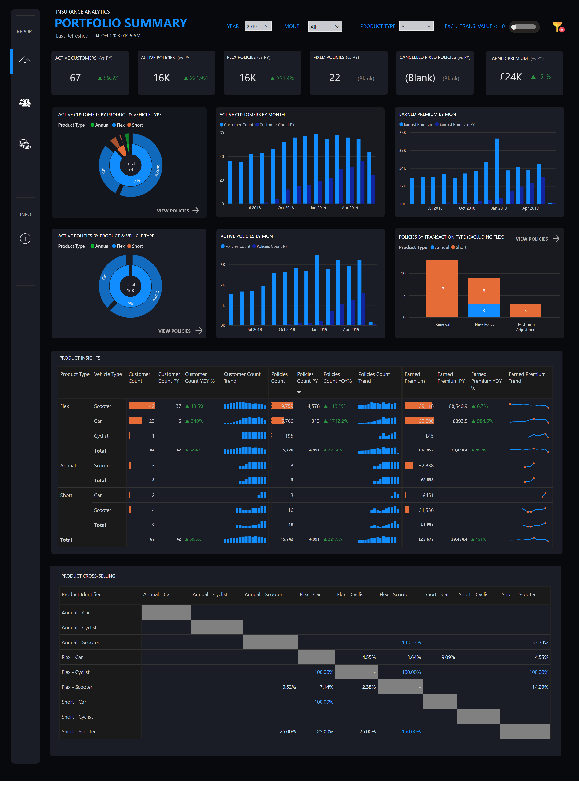
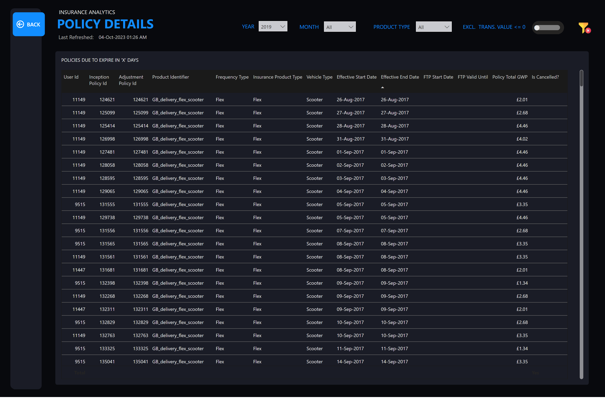

# Insurance Analytics — Portfolio Optimisation

## Overview

An insurance portfolio report built to summarize portfolio composition and support detailed policy investigation. The design combines a high-level portfolio view with a dedicated policy drill-through experience.

The report combines customer, policy, premium, product-mix, and cross-selling indicators in a single portfolio view.

## Report pages

1. **Portfolio Summary** — high-level portfolio composition and performance
2. **Policy Details Drillthrough** — detailed view of a selected policy
3. **Info** — report guidance and supporting information

## Business questions

- How is the insurance portfolio distributed across key segments?
- Where are concentration, performance, or risk imbalances visible?
- Which policies require closer investigation?
- What portfolio actions could improve the overall mix?

## Capabilities demonstrated

- Portfolio-level KPI and segmentation design
- Summary-to-policy analytical flow
- Context-aware policy drill-through
- Insurance-domain report navigation

## Gallery

### Portfolio summary

### Policy drill-through

## Data and privacy

The source PBIX remains private and is excluded from Git. Policy identifiers, customer data, pricing, exposure, claims, and other commercially sensitive values must be removed or replaced before publication.
