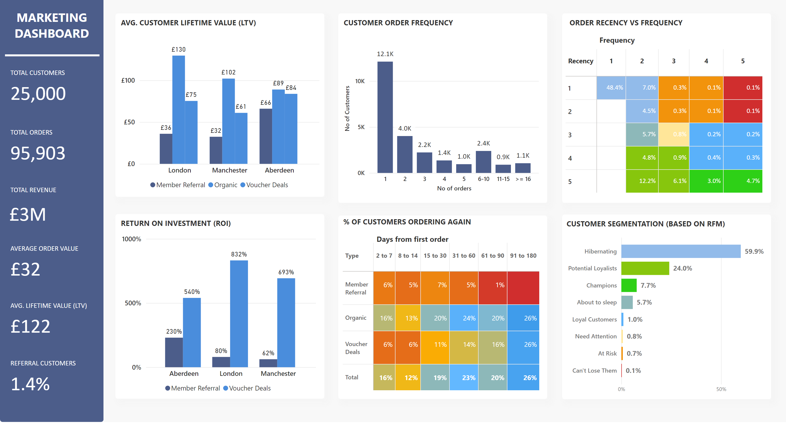
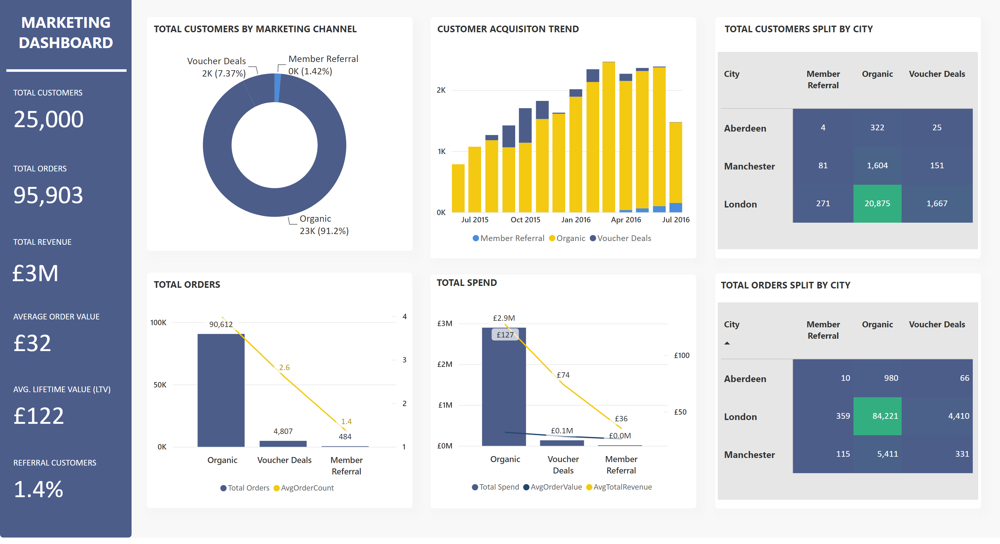

# Marketing Analytics — Campaign Analysis

## Overview

An interactive marketing analytics report designed to evaluate customer value, purchasing behavior, acquisition channels, and campaign effectiveness. The report connects high-level commercial KPIs with customer segmentation and channel-level performance.

The screenshots present aggregate marketing data and contain no customer names, contact details, personal identifiers, or tenant information.

## Report views

1. **Customer Value & Segmentation** — lifetime value, purchase frequency, recency, repeat behavior, ROI, and RFM segments
2. **Channel Performance & Acquisition** — customer acquisition, orders, spending, geographic mix, and marketing-channel contribution

## Business questions

- Which marketing channels acquire the most customers and generate the most orders?
- How do lifetime value and return on investment vary by city and channel?
- How recently and frequently are customers purchasing?
- Which RFM segments represent loyal customers, potential loyalists, or customers at risk?
- Where should campaign investment and retention activity be prioritized?

## Key metrics

- Total customers, orders, and revenue
- Average order value and customer lifetime value
- Referral-customer share
- Customer acquisition trend
- Marketing return on investment
- Recency, frequency, and repeat-order behavior
- RFM customer segmentation

## Capabilities demonstrated

- Marketing KPI design
- Customer lifetime value analysis
- Recency-frequency-monetary segmentation
- Campaign and channel ROI comparison
- Customer acquisition and repeat-purchase analysis
- Geographic and channel performance analysis
- Executive dashboard storytelling

## Gallery

### Customer value and segmentation

### Channel performance and acquisition

## Data and privacy

Only aggregate dashboard screenshots are published. The project page contains no customer-level records, personal information, credentials, tenant links, or source PBIX file.

